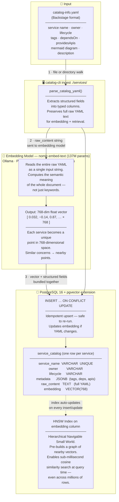
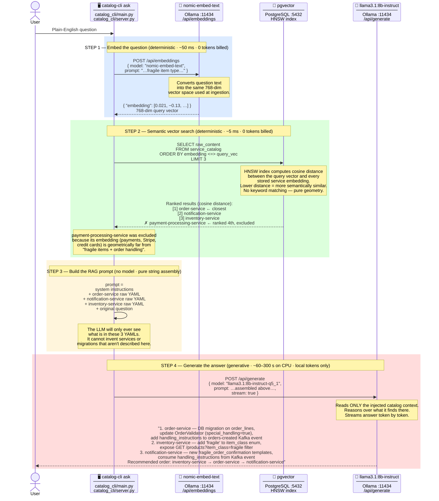
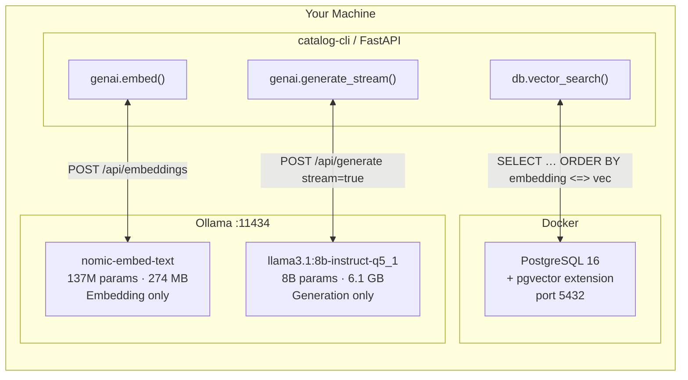

# RAG Requirements Gathering Pipeline

How the service catalog turns a plain-English question into a grounded,
architecture-aware answer — without hallucinating services that don't exist.

There are two separate phases:
data goes **in** once (ingestion), then you **query** it many times (RAG).

---

## Phase 1 — Ingestion

How service knowledge gets stored as searchable vectors.



### What the embedding model actually does

The embedding model (`nomic-embed-text`) converts the *meaning* of your entire
YAML description into a single array of 768 numbers.
This is not keyword indexing — it understands semantics.

A service that talks about *"fragile items, warehouse zones, handling rules"*
will produce a vector that is geometrically close to a question that asks about
*"adding a fragile item type to the order system"*, even if none of those exact
words appear in the question.

---

## Phase 2 — RAG Query

What happens when a user asks a requirements-gathering question.

> **Example question used:**
> *"We want to add a new 'fragile' item type to the order system.
> What services are affected and what changes are needed in each one?"*



---

## Key decisions and why they happen where they do

| Decision | Made by | Mechanism | Cost |
|---|---|---|---|
| Which services are relevant to the question? | **pgvector HNSW** | Cosine similarity between query vector and each row's embedding | 0 tokens · ~5 ms |
| Should payment-processing-service be included? | **pgvector HNSW** | Its vector is geometrically far from the query — ranked 4th, outside top-K | 0 tokens · automatic |
| What migrations are needed in order-service? | **llama3.1:8b** | Reads the injected order-service YAML and reasons over it | Local tokens only |
| Can the LLM invent a service that isn't in the catalog? | **RAG architecture** | Prompt is bounded by what pgvector returned — unknown services are invisible | Structurally impossible |
| Is the answer grounded in real catalog data? | **RAG architecture** | Every claim the LLM makes is traceable to one of the top-K YAML chunks | Yes, by design |

---

## Token cost breakdown

```
Step 1 — embed question:    local model, ~50 ms       → $0.00
Step 2 — vector search:     SQL query, ~5 ms          → $0.00
Step 3 — build prompt:      string concat             → $0.00
Step 4 — LLM generation:    local model, runs on CPU  → $0.00

Total external API cost:    $0.00
```

This is the "AI-first, zero external cost" design.
Deterministic commands (`list`, `get`, `tags`, `deps`, `diagram`) hit Postgres
directly and never touch a model at all.
Only `ask` runs inference, and both models run entirely on your machine via Ollama.

---

## Component map



---

## Files involved in the pipeline

| File | Role in the pipeline |
|---|---|
| [`catalog_cli/genai.py`](../catalog_cli/genai.py) | Ollama client — `embed()` calls nomic-embed-text, `generate_stream()` calls llama3.1 |
| [`catalog_cli/db.py`](../catalog_cli/db.py) | `vector_search()` runs the pgvector cosine query, `upsert_service()` stores embeddings |
| [`catalog_cli/ingest.py`](../catalog_cli/ingest.py) | Parses YAML, calls `genai.embed()`, calls `db.upsert_service()` |
| [`catalog_cli/main.py`](../catalog_cli/main.py) | `ask` command — orchestrates embed → search → prompt → generate |
| [`catalog_cli/server.py`](../catalog_cli/server.py) | `POST /api/ask` — same pipeline over HTTP |
| [`catalog_cli/config.py`](../catalog_cli/config.py) | `OLLAMA_EMBED_MODEL`, `OLLAMA_GENERATE_MODEL`, `EMBEDDING_DIM`, `RAG_TOP_K` |
| [`init.sql`](../init.sql) / [`db/init.sql`](../db/init.sql) | Creates `VECTOR(768)` column and HNSW index on container start |
| [`services/*/catalog-info.yaml`](../services/) | Source data — parsed and embedded during ingestion |
